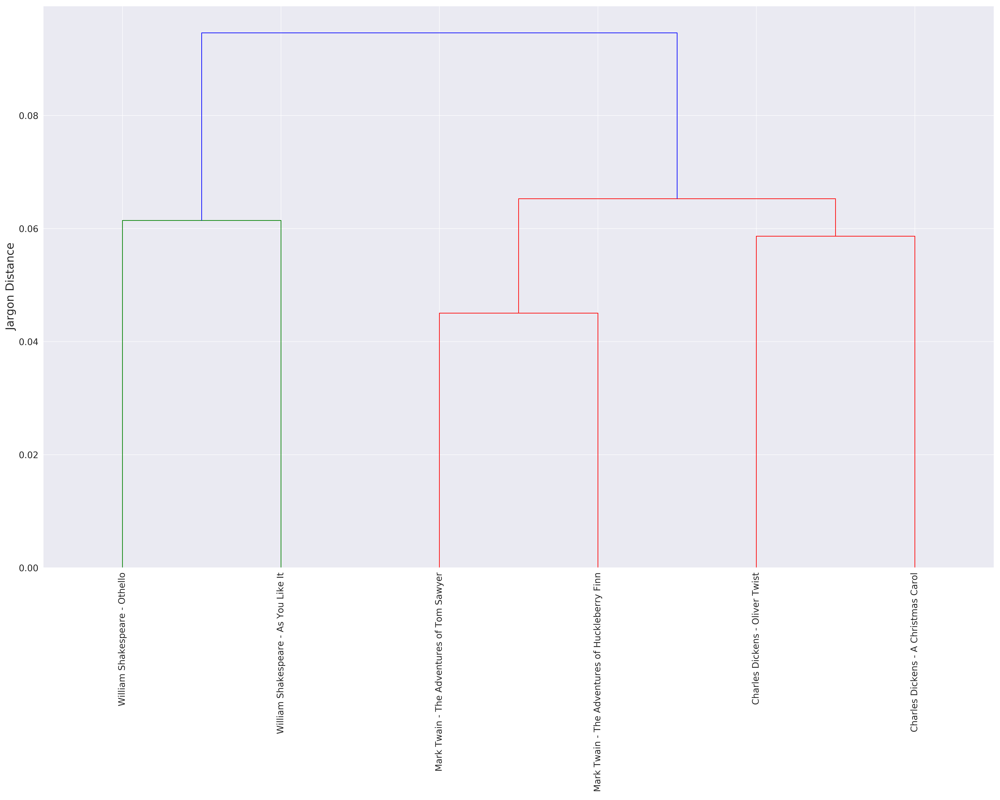

# Jargon Distance

Jason Portenoy 2018

Implement the jargon distance measure from <a href="https://doi.org/10.15195/v1.a15" target="_blank">Vilhena et al. “Finding Cultural Holes: How Structure and Culture Diverge in Networks of Scholarly Communication.” (2014)</a>

### Installation

Install from PyPI:

`pip install jargon-distance`

### Usage

Initialize a `JargonDistance` instance with a `term_counts` dict and (optionally) a `group_map` dict.
`term_counts` is a mapping of document -> term counter (Counter object).

```
from jargon_distance import JargonDistance
j = JargonDistance(term_counts)
```

Then, calculate the jargon distances:

```
j.calculate_jargon_distance()
j.write_to_file('jargon_distance.csv')
```

The `jargon_distance.analysis` module can be used to visualize the jargon distance calculations. For example, below is a dendrogram showing the jargon distances between the text (unigrams) of different works of literature (from the [demo.ipynb](demo.ipynb) notebook).



See [demo.ipynb](demo.ipynb) for a more detailed example.
